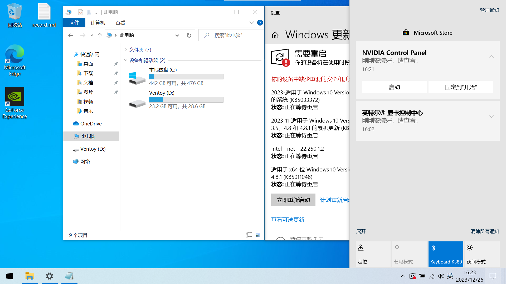
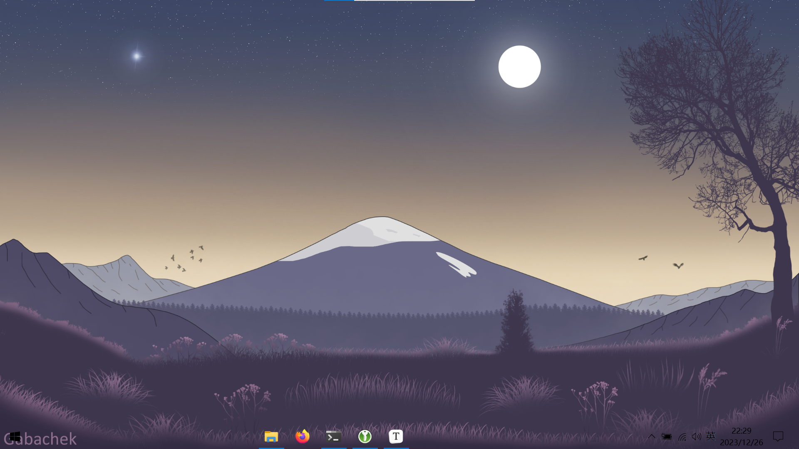
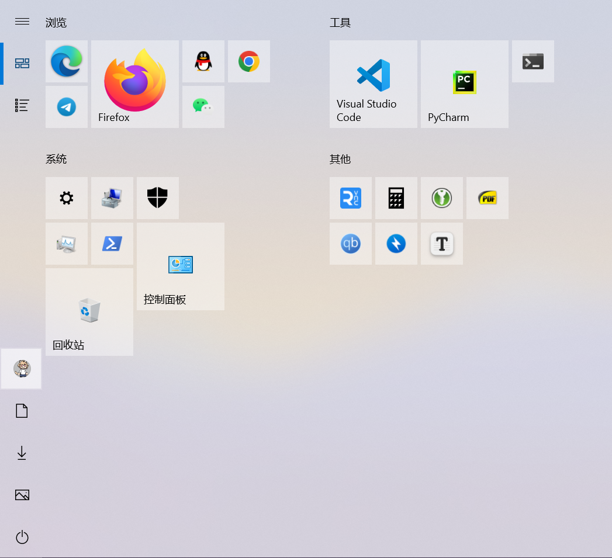

> 一年的结算整理，从收拾混乱不堪的系统开始...

## 恢复原貌

备份一下文件，直接抹盘重装，别来无恙~

不联网新开一个本地账户，然后再接入等待驱动自动安装，独显得去官网手动补一个



万事俱备，启动！

## 开启&移除服务

Windows 自带了很多我用不到的小垃圾，像是地图、Xbox 等等，直接狠狠地给他卸载~

Onedrive，OneNote 还不错，可惜我不怎么用，卸载~

至于额外的服务，目前只有勾上文件后缀了，像是虚拟化之类的等用到再考虑吧

## 基础软件安装

为了避免混乱并方便管理，优先使用 Scoop 这样的下载器来统一安装卸载，不方便管理的能用便携就便携，再剩下的只能由他去了qwq

### 安装 Scoop

依照官网指示，安装、搜索并下载软件（ dns 污染是可以预见的，先搞一下

```bash
Set-ExecutionPolicy -ExecutionPolicy RemoteSigned -Scope CurrentUser
Invoke-RestMethod -Uri https://get.scoop.sh | Invoke-Expression
```
### 安装软件

Scoop 可以通过 json 文件记录软件包，当然首次使用我就挨个下了

可以先准备好代理工具，然后给git单独配置一下代理

下载一个便携版的 clash-verge（很遗憾 clash 家族跑路了，好在还能用

```bash
scoop install 7zip git # 下载解压必须
git config --global http.proxy 127.0.0.1:7890
git config --global https.proxy 127.0.0.1:7890
scoop bucket add extras 
scoop bucket add nerd-fonts
scoop bucket add dorado https://github.com/chawyehsu/dorado
scoop bucket add versions
scoop install sudo touch
scoop install windows-terminal powertoys vscode vcredist2022
scoop install bandizip ffmpeg yazi keepassxc typora qbittorrent-enhanced sumartapdf
scoop install telegram firefox googlechrome qq wechat
scoop install JetBrainsMono-NF JetBrains-Mono
scoop install vncviewer
```
必须要说明的是，Scoop 不是专业的包管理器，很容易产生各种问题，特别是软件更新方面，有良心软件像是 Firefox 会提示如何安排，也会有很多软件因为 scoop 脚本更新不及时导致的管理混乱，这个没啥好办法只能忍忍了QAQ

### 语言环境

使用 Scoop 很方便安装，但是会在版本管理上出现小问题，具体问题具体分析吧

先提前安装一些需要用到的

```bash
scoop install python nodejs docker
scoop install pycharm
```

至此，基本上就完成了，接下来就是对于软件的一些个人配置了，这个就没有展开的必要了。

### 导出备份

Scoop 可以通过 json 来快速安装软件，使用 `import` `export` 导入导出

```bash
scoop export > scoopfile.json
scoop import scoopfile.json
```

## 简单美化

实际上 Windows 可美化的内容比较少，而且美化以易用为前提，感觉也就换个壁纸最实际（



然后就是贴几个磁贴，磁贴在主用鼠标的情况下还是非常舒服的，整体流畅度也很高，搞不明白为什么 Win11 给砍了

再有就是把任务栏透明一下，然后居个中，简洁也挺好的



## 回顾

本来以为重装 Windows 会花一些时间，没想到 Scoop 已经发展到这种程度了，基本上我用到的软件都被官方收录了，再借助一些个人维护的完全满足了需求，软件顺利安装 Windows 也就没啥好摆弄的了。

除去最基本的设置，仅仅新建了一个 `Data/` 收录软件数据和备份，一个 `Software/` 收容便携软件。
